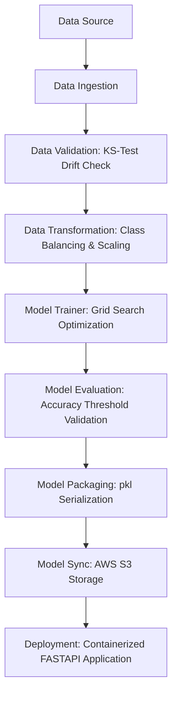

# 🛡️ Network Security Phishing Data Detection System

A state-of-the-art machine learning system designed to detect and block malicious network phishing websites. Powered by a robust, modular training pipeline and containerized for automated cloud deployment, this system offers high-accuracy classification, statistical drift validation, and reliable MLOps tracking.

---

## 🏗️ System Architecture

This project is built using modular, production-grade enterprise software architecture:



---

## 🌟 Key Features

* **Statistical Validation**: Integrates Kolmogorov-Smirnov statistical tests in the Validation phase to automatically detect data drift before training.
* **Optimized Classifier Grid Search**: Leverages a highly-optimized parameter grid search for multiple classification models (Gradient Boosting, Random Forest, Decision Tree, Logistic Regression), reducing grid search durations from over an hour to less than a minute.
* **Error-Resilient MLflow Logging**: Outfitted with network-resilient wrappers around Dagshub and MLflow telemetry trackers, ensuring local `model.pkl` generation and synchronization even under unstable remote connections.
* **Enterprise Cloud Deployment**: Optimized containerization utilizing multi-stage Docker builds and automated continuous delivery pushing direct to **Amazon ECR** and deploying to **AWS EC2**.

---

## ⚙️ Project Structure

```
├── .github/workflows/      # Automated CI/CD GitHub Actions pipelines
├── networksecurity/        # Core Modular Pipeline Packages
│   ├── cloud/              # AWS S3 model synchronization logic
│   ├── components/         # Pipeline Phases (Ingestion, Validation, Trainer)
│   ├── entity/             # Typed Configurations and Artifact schemas
│   ├── pipeline/           # Training and Prediction Pipelines
│   └── utils/              # General helper functions and Model Evaluators
├── templates/              # Jinja2 templates for Web GUI
├── app.py                  # FastAPI Application Entrypoint
├── Dockerfile              # Highly-cached container compilation layers
├── requirements.txt        # Third-party library dependencies
└── setup.py                # Library packaging settings
```

---

## 🚀 Getting Started

### 1. Prerequisites
Ensure you have Python 3.10+ and Docker installed.

### 2. Configure Environment
Create a `.env` file in the root directory:
```env
MONGODB_URI="your_mongodb_connection_string"
AWS_ACCESS_KEY_ID="your_aws_access_key"
AWS_SECRET_ACCESS_KEY="your_aws_secret_key"
AWS_REGION="ap-south-1"
```

### 3. Local Installation
```bash
# Clone the repository
git clone https://github.com/your-username/networksecurity.git

# Install dependencies and modular package
pip install -r requirements.txt
pip install -e .
```

### 4. Run the Training Pipeline
To trigger ingestion, validation, model training, and model registry:
```bash
python main.py
```

### 5. Start the API Server
```bash
python app.py
```
Open [http://localhost:8080](http://localhost:8080) to access the interactive Swagger documentation and visual web dashboard.

---

## ☁️ Continuous Integration & Delivery (CI/CD)

The project includes a complete automation pipeline configured in `.github/workflows/main.yml`.

### 🔑 GitHub Secrets Configuration
To enable AWS containerized deliveries, register the following parameters under your Repository Secrets (`Settings -> Secrets and variables -> Actions`):
1. **`AWS_ACCESS_KEY_ID`**: Your IAM credential access key.
2. **`AWS_SECRET_ACCESS_KEY`**: Your IAM credential secret key.
3. **`AWS_REGION`**: Your target AWS region (`ap-south-1`).
4. **`ECR_REPOSITORY_NAME`**: Your Amazon Elastic Container Registry name (`networksecurity`).
5. **`MONGODB_URI`**: Your MongoDB database connection string.

### 🐳 Docker Compilation Optimization
Our `Dockerfile` leverages multi-layer pip caching to compile images in under **2 seconds** for subsequent code changes, and installs `awscli` directly through pip to avoid unstable Debian apt repository mirror connections.
